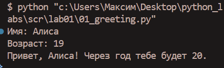
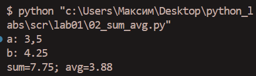
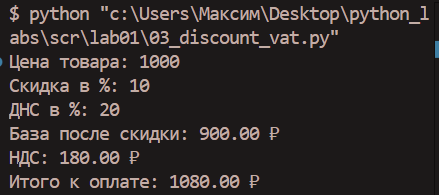
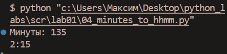
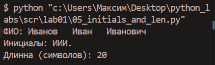
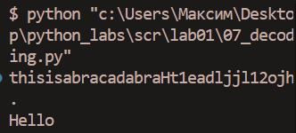

# Отчет по лабораторной работе №1

## Задание 1

*Рис. 1. Результат выполнения скрипта 01_greeting.py (Приветствие и расчет возраста)*

## Задание 2

*Рис. 2. Результат выполнения скрипта 02_sum_avg.py (Вычисление суммы и среднего арифметического)*

## Задание 3

*Рис. 3. Результат выполнения скрипта 03_discount_vat.py (Расчет скидки и НДС)*

## Задание 4

*Рис. 4. Результат выполнения скрипта 04_minutes_to_hhmm.py (Конвертация минут в формат часы:минуты)*

## Задание 5

*Рис. 5. Результат выполнения скрипта 05_initials_and_len.py (Получение инициалов из ФИО и подсчет длины строки)*

## Задание 6

*Рис. 5. Результат выполнения скрипта 06_count.py (Подсчет очных и заочных студентов)*

## Задание 7

*Рис. 6. Результат выполнения скрипта 07_decoding.py (Декодирование скрытого сообщения)*