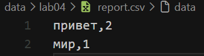
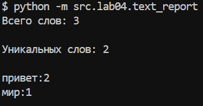
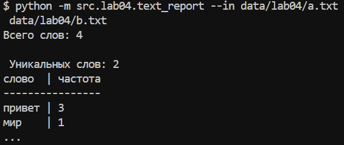
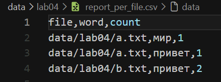
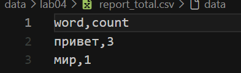

# Отчет по лабораторной работе №4 — Файлы: TXT/CSV и отчеты по текстовой статистике

## Задание A — модуль ввода/вывода `src/lab04/io_txt_csv.py`

Реализован модуль для чтения текстовых файлов и записи результатов в CSV. Для работы с путями используется `Path`, а для формирования CSV — стандартный модуль `csv`.

### 1. Функция `read_text`

Функция читает файл целиком и возвращает его содержимое в виде одной строки. По умолчанию используется кодировка UTF-8, но при необходимости можно передать другую кодировку, например `encoding="cp1251"`.

```python
from pathlib import Path
import csv


def read_text(path: str | Path, encoding: str = "utf-8") -> str:
    '''Считывает текст по указанному пути

    Args:
        path: Путь к файлу в формате строки или Path
        encoding: Тип кодировки файла (пример: encoding="cp1251"), по умолчанию utf-8

    Returns:
        Прочитанный файл в виде строки
    '''

    return Path(path).read_text(encoding=encoding)
```

Если файл не найден, возникает `FileNotFoundError`. При несовпадении кодировки возникает `UnicodeDecodeError`.

### 2. Функция `write_csv`

Функция записывает строки в CSV-файл. Перед записью проверяется, что все строки имеют одинаковую длину. Если длины отличаются, вызывается `ValueError`.

```python
def write_csv(rows: list[tuple | list], path: str | Path, header: tuple[str, ...] | None = None) -> None:
    '''Записывает частоты слов в csv файл
    Args:
        rows: Список строк которые нужно внести в файл
        path: Путь к файлу записи
        header: Заголовок файла

    Returns:
        None

    Raises:
        ValueError: Строки разной длинны
    '''
    if rows:
        etalon = len(rows[0])
        for r in rows:
            if len(r) != etalon:
                raise ValueError('Строки разной длинны')

    ensure_parent_dir(path)
    with Path(path).open('w', newline="", encoding="utf-8") as f:
        w = csv.writer(f)
        if header:
            w.writerow(header)
        for row in rows:
            w.writerow(row)
```

Если передан параметр `header`, он записывается первой строкой файла.

### 3. Функция `ensure_parent_dir`

Функция проверяет наличие родительской папки и создает ее вместе со всеми отсутствующими вложенными папками.

```python
def ensure_parent_dir(path: str | Path) -> None:
    '''Проверяет наличие родительских папок, если их нет, то создает их
    Args:
        path: Путь к файлу в формате строки или Path

    Returns:
        None
    '''

    Path(path).parent.mkdir(parents=True, exist_ok=True)
```



*Рис. 1. Результат записи данных в CSV-файл.*


## Задание B — скрипт статистики `src/lab04/text_report.py`

Скрипт читает текстовые файлы, использует функции `normalize`, `tokenize`, `count_freq` и `top_n` из лабораторной работы №3, а затем сохраняет частоты слов в CSV-файлы.

### Исходный код `src/lab04/text_report.py`

```python
from src.lab04.io_txt_csv import read_text, write_csv
from src.lib.text import normalize, tokenize, top_n, count_freq
import argparse

# region Берем аргументы
parser = argparse.ArgumentParser()
parser.add_argument('--in', nargs='+', dest='input_files')
parser.add_argument('--out', nargs='+', dest='output_files')
args = parser.parse_args()
'''
python -m src.lab04.text_report --in data/b.txt data/a.txt --out data/out.csv
Это короче крутая команда для вызова чтобы я не забыл
'''
# endregion

if args.output_files and len(args.output_files) > 1:
    raise ValueError('Сообщено слишком много файлов выхода')

if args.input_files is None:
    # region Для одного файла
    file_path = 'data/lab04/input.txt'
    text = read_text(file_path)
    normal_text = normalize(text)
    tokens = tokenize(normal_text)
    words_cnt = count_freq(tokens)
    top_words = top_n(words_cnt)

    if args.output_files is None:
        path = 'data/lab04/report.csv'
    else:
        path = args.output_files[0]

    all_sorted_words = top_n(words_cnt, len(words_cnt))
    write_csv(list(all_sorted_words), path)

    print(f'Всего слов: {len(tokens)} \n \nУникальных слов: {len(set(tokens))} \n')
    for tops in top_words:
        print(f'{tops[0]}:{tops[1]}')
    # endregion
else:
    # region Для много файлов
    per_file = [] # Здесь лежат данные в формате [file_path, word, count]
    all_cnt = {} # А тут лежит словарь где указаны частоты всех слов

    for file_path in sorted(args.input_files): # Тут шедевроцикл где я прохожусь по файлам
        text = read_text(file_path)
        normal_text = normalize(text)
        tokens = tokenize(normal_text)
        words_cnt = count_freq(tokens)
        top_all_words = top_n(words_cnt, len(words_cnt))


        for word, count in top_all_words:
            per_file.append([file_path, word, count])

        for word, count in words_cnt.items():
            all_cnt[word] = all_cnt.get(word, 0) + count
    # endregion

    # region Итоговая запись
    s_cnt = top_n(all_cnt, len(all_cnt)) # Это чтобы отсортировать словарь
    write_csv(per_file, 'data/lab04/report_per_file.csv', header=('file','word','count'))
    write_csv(list(s_cnt), 'data/lab04/report_total.csv', header=('word','count'))

    total_words = sum(all_cnt.values())
    unique_words = len(s_cnt)

    print(f'Всего слов: {total_words} \n \n Уникальных слов: {unique_words}')
    max_len = max(max([len(word[0]) for word in s_cnt[:5]]), len('слово'))
    head = f'{"слово":<{max_len}} | частота'

    print(head)
    print('-' * len(head))
    for top in s_cnt[:5]:
        print(f'{top[0]:<{max_len}} | {top[1]}')
    print('...')
    # А тут был красивый вывод (см наверх)
    # endregion
```

### Пример запуска для одного файла

```bash
python -m src.lab04.text_report
```

В этом режиме читается `data/lab04/input.txt`, а результат записывается в `data/lab04/report.csv`.



*Рис. 2. Результат запуска скрипта для одного входного файла.*

### Пример запуска для нескольких файлов

```bash
python -m src.lab04.text_report --in data/lab04/a.txt data/lab04/b.txt
```

В этом режиме отдельно создаются `report_per_file.csv` и `report_total.csv`.



*Рис. 3. Результат запуска скрипта для нескольких входных файлов.*

### Отчет по каждому файлу

```csv
file,word,count
data/lab04/a.txt,привет,1
data/lab04/a.txt,мир,1
data/lab04/b.txt,привет,2
```



*Рис. 4. Содержимое отчета `report_per_file.csv`.*

### Сводный отчет

```csv
word,count
привет,3
мир,1
```



*Рис. 5. Содержимое сводного отчета `report_total.csv`.*
